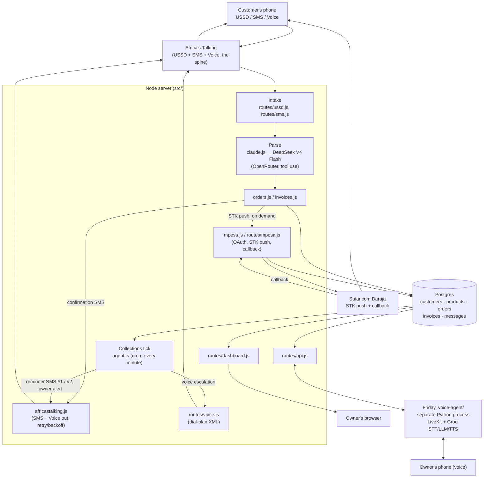

# Order-to-Cash Agent

An event-triggered agent for SME and Jua Kali manufacturers. It takes an order,
confirms and schedules it, collects payment by M-Pesa, and chases late payment
with an escalating SMS then a Voice call. Built for the Africa's Talking
Manufacturing Hackathon, Nairobi, 27 Aug 2026.

See `BUILD_PLAN.md` for the full design, the call sequences, and the demo script.
See `AI_COMPONENTS.md` for the two AI systems in this build: the order-parsing
brain and the owner voice assistant, "Friday".

## Architecture



The customer never sees a screen. Every order arrives by USSD, SMS, or Voice
through Africa's Talking, gets parsed and priced, and lives in one Postgres
schema that both the collections cron and the owner's dashboard read from. The
only two things that call `routes/api.js` from outside the Node process are
Friday (the owner's voice assistant) and, indirectly, the owner's own voice.

## Business impact

A Jua Kali fabricator with a few workers typically tracks orders by memory, a
notebook, or a WhatsApp thread, and chases late payment by phone, one customer
at a time. Take a shop doing 20 orders a month with a normal share running
late, say 6: chasing one overdue invoice by phone, redial and no answer
included, runs about 15 minutes. That is roughly 90 minutes of the owner's own
time a month spent chasing money instead of fabricating, before counting the
time lost to a lost order slip or a buried WhatsApp message.

The agent removes most of that. Reminder SMS #1 and #2 and the voice
escalation fire on a timer with zero owner involvement; the owner only steps
in when Friday flags an invoice that survived the whole ladder unpaid.
Payment moves from "let me send you my till number" to one M-Pesa prompt the
customer taps to pay. Orders stop living in a notebook that can be lost.

These are reasoned estimates from a hackathon build, not measurements from a
live deployment. No manufacturer has run this for a full month yet. The real
test is whether owner phone-time on collections drops close to zero once one
does.

## Quickstart

```bash
npm install
cp .env.example .env        # fill in what you have; it boots without any of it
npm start                   # server on :3000, dashboard at http://localhost:3000
```

Everything runs in dry-run mode with no credentials: SMS, Voice and M-Pesa are
logged to the console instead of sent, so you can build and test the flow before
keys arrive.

## With a database

```bash
# set DATABASE_URL in .env, then:
npm run migrate             # create tables + seed the product catalog
npm run seed:demo           # optional: one overdue invoice for the live demo
npm start
```

## Dashboard

`GET /` is a live view of invoices and the message trail. Every SMS, call, and
M-Pesa event shows up there as it happens.

<!-- TODO: screenshot. Run `npm run seed:demo` then `npm start`, open
     http://localhost:3000, and drop the image here as docs/dashboard.png.
     Not generated in this pass: AT_API_KEY and OPENROUTER_API_KEY are both
     live in .env, so starting the server for real fires an actual SMS (and,
     left running, a real voice call) rather than a dry-run stand-in. -->

## Endpoints

| Method | Path | Caller |
|---|---|---|
| GET  | `/health` | Marketplace / you |
| GET  | `/` | Owner dashboard |
| POST | `/webhooks/ussd` | Africa's Talking (USSD) |
| POST | `/webhooks/sms/inbound` | Africa's Talking (inbound SMS) |
| POST | `/webhooks/voice` | Africa's Talking (Voice) |
| POST | `/webhooks/mpesa/callback` | Safaricom (STK result) |
| GET  | `/api/summary`, `/api/invoices/overdue`, `/api/invoices/unpaid`, `/api/invoices/:id`, `/api/orders/unattended`, `/api/orders/:id` | `voice-agent/` (Friday) |
| POST | `/api/invoices/:id/remind`, `/api/invoices/:id/stkpush` | `voice-agent/` (Friday) |

Point the Africa's Talking and Daraja callbacks at `PUBLIC_BASE_URL` + the path.
In development, expose your machine with a tunnel and set `PUBLIC_BASE_URL` to it.

Set `VOICE_AGENT_API_KEY` to require an `x-api-key` header on the `/api/*`
routes — worth doing once `PUBLIC_BASE_URL` is a public tunnel, since two of
those routes reach a real customer (an SMS, and an M-Pesa payment prompt).

## Owner voice assistant

`voice-agent/` is Friday, a LiveKit voice agent the owner talks to directly:
overdue invoices, order lookups, on-demand reminders. It never talks to
customers and never touches Postgres directly, it calls the `/api/*` routes
above. See `voice-agent/README.md` to run it, and `AI_COMPONENTS.md` for how
its Groq-based STT/LLM/TTS pipeline differs from the order-parsing brain.

## Who owns what (one-day split)

- **A — Intake:** `routes/ussd.js`, `routes/sms.js`, `claude.js`, `orders.js`
- **B — Collections:** `agent.js`, `invoices.js`, `africastalking.js`, `routes/voice.js`
- **C — Payments:** `mpesa.js`, `routes/mpesa.js`
- **D — Surface + ship:** `routes/dashboard.js`, `routes/api.js`, `Dockerfile`, Marketplace metadata, `voice-agent/`
